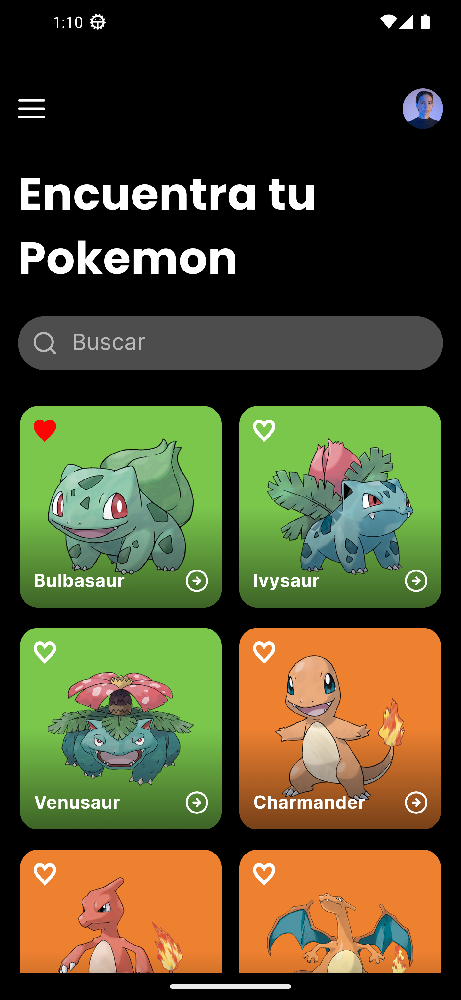
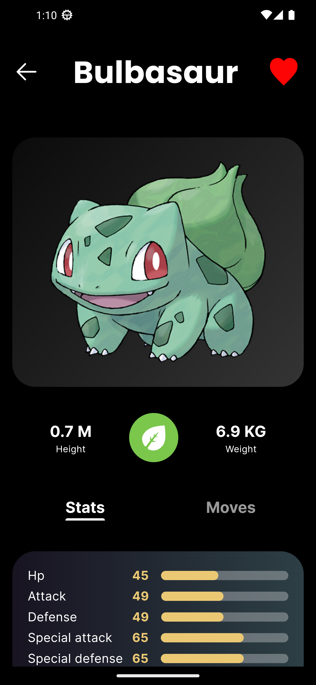

# Pokémon App

 

## Descripción

Esta es una aplicación de Pokémon desarrollada con Flutter. La aplicación permite a los usuarios buscar y visualizar detalles de varios Pokémon. La arquitectura del proyecto sigue principios de **Clean Architecture** para asegurar un código modular, mantenible y testeable.

## Arquitectura del Proyecto

El proyecto está estructurado en las siguientes capas:

### 1. Core

- **network**: Manejo de conexiones de red.
- **routes**: Configuración de las rutas de navegación.
- **services**: Servicios generales utilizados en la aplicación.
- **styles**: Definición de estilos y temas.
- **utils**: Utilidades y helpers comunes.

### 2. Features

Cada funcionalidad principal de la aplicación tiene su propio módulo en `features`. En este caso, tenemos el módulo de Pokémon.

#### Pokémon

- **data**: 
  - `models`: Definición de modelos de datos.
  - `providers`: Proveedores de datos, por ejemplo, APIs.
  - `repositories`: Implementaciones de los repositorios.
- **domain**:
  - `entities`: Entidades de negocio.
  - `repositories`: Interfaces de los repositorios.
  - `usecases`: Casos de uso que contienen la lógica de negocio.
- **presentation**:
  - `pokemon_detail`: 
    - `controllers`: Controladores de la pantalla de detalles.
    - `pages`: Páginas de la pantalla de detalles.
    - `widgets`: Widgets específicos de la pantalla de detalles.
  - `pokemon_list`:
    - `bindings`: Inyecciones de dependencias.
    - `controllers`: Controladores de la pantalla de lista.
    - `pages`: Páginas de la pantalla de lista.
    - `widgets`: Widgets específicos de la pantalla de lista.

## Instalación

1. Clona este repositorio:
   ```sh
   git clone https://github.com/tu-usuario/pokemon-app.git
   cd pokemon-app
   ```

2. Instala las dependencias:
   ```sh
   flutter pub get
   ```

3. Corre la aplicación:
   ```sh
   flutter run
   ```

## Dependencias

Las principales dependencias utilizadas en este proyecto son:

- `flutter`: SDK principal para desarrollar la aplicación.
- `http`: Para realizar solicitudes HTTP.
- `get`: Para la gestión del estado y la navegación.
- `palette_generator`: Para generar paletas de colores a partir de imágenes.
- `fast_cached_network_image`: Para manejar la carga de imágenes con cacheo.
- `flutter_svg`: Para renderizar imágenes SVG.
- `flutter_isolate`: Para ejecutar tareas en aislamientos separados.
- `dartz`: Para manejar tipos funcionales.
- `shared_preferences`: Para persistir datos localmente.
- `flutter_staggered_animations`: Para crear animaciones escalonadas.

## Pruebas

### Pruebas Unitarias y de Widgets

Las pruebas unitarias y de widgets se encuentran en el directorio `test`.

Para ejecutar todas las pruebas unitarias y de widgets:
```sh
flutter test
```

## Estructura de Directorios

```plaintext
project_root/
├── lib/
│   ├── core/
│   │   ├── network/
│   │   ├── routes/
│   │   ├── services/
│   │   ├── styles/
│   │   └── utils/
│   └── features/
│       └── pokemon/
│           ├── data/
│           │   ├── models/
│           │   ├── providers/
│           │   └── repositories/
│           ├── domain/
│           │   ├── entities/
│           │   ├── repositories/
│           │   └── usecases/
│           └── presentation/
│               ├── pokemon_detail/
│               │   ├── controllers/
│               │   ├── pages/
│               │   └── widgets/
│               └── pokemon_list/
│                   ├── bindings/
│                   ├── controllers/
│                   ├── pages/
│                   └── widgets/
├── test/
│   └── features/
│       └── pokemon/
│           ├── data/
│           │   └── models/
│           └── domain/
└──             └── entities/
```

## Créditos

Desarrollado por [Kevin Piazzoli](https://github.com/kevin4dhd).

## Licencia

Este proyecto está licenciado bajo la Licencia MIT - ver el archivo [LICENSE](LICENSE) para más detalles.
